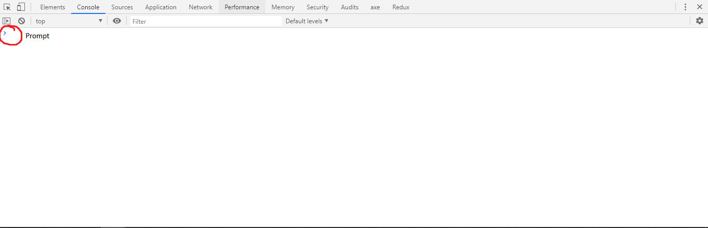
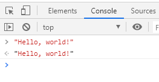

# Understanding and writing JavaScript programs with simple data

In the previous article,[^1] [Getting started with computing, computers, and computer science](./0-getting-started.md), I mentioned programming a few times. In this article we'll write our first JavaScript programs and explore what programs are in a little more depth.

## Hello, world: our first JavaScript program

To use most programming languages you have to download an environment to run programs. Sometimes you also need to download a specialized text editor to write programs.

We'll actually do both of these for our purposes in a future chapter, but one of the nice things about JavaScript is if you have a web browser you can already run your own JavaScript programs _without_ having to download any specialized tools. You can do this through the browser's **console.**

### How to access the JavaScript console

_Mac users can substitute the `COMMAND` key for `CTRL` and `OPTION` for `ALT`._

First, open a new browser tab with a blank window. You should be able to do this by putting `about:blank` in the URL bar.

This will keep items specific to any particular web page from showing up in your console.

Opening the console will vary by browser, but here are the basics:

- If you have Google Chrome, bring up the console with the keyboard shortcut `CTRL+ALT+J`, by pressing `F12` and then selecting the `console` tab in the development tools that pop up, or by right-clicking anywhere on a web page, selecting `Inspect element` in the context menu, then selecting the `console` tab.
- In Firefox use the keyboard shortcut `CTRL+ALT+K`, press `F12` and select the `console` tab, or press `ALT` to activate the main menu and then select `Tools > Web Developer > Web Console`.
  - Note that in Firefox the `Web Console` is separate from the `Browser Console`. The differences between the two don't matter for now.
- On Safari you may need to activate the console. Open the menu bar, choose `Safari > Preferences`, click the `Advanced` tab, then choose `Show Develop menu in menu bar.` Then open the console with `CTRL` + `ALT` + C.
- If you're using Microsoft Edge, follow these steps:
  1. Download and install a better browser for development work, like Chrome or Firefox.
  2. Close Edge and open the newly-installed one.
  3. Follow the above steps for the browser you've chosen.

### Writing your first JavaScript program

Now that you've got the console open, make sure your cursor is visible next to the prompt.

*Console prompt in Google Chrome*

Simply type into the console `"Hello, world!"` and press `ENTER`.

The console should repeat `"Hello, world!"` back to you.[^2]

That's right, your first JavaScript program is simply a sentence in quotation marks!

This is actually a complete, valid JavaScript program, but it's not terribly useful. We'll write much better ones by the time we're through this series.

### How the interpreter works to run your first program

The console will simply evaluate any valid JavaScript value that you type into it and **return** it back to you as itself.

A valid piece of code that forms a complete "thought" in JavaScript, analogous to a sentence in English, is called a **statement.**

A statement the JavaScript interpreter reads, evaluates, and returns a value from is called an **expression.**

Any value that's valid to the JavaScript interpreter can be used as an expression.

You should always end expressions with a semicolon (;).[^3]

## What is a program?

Now that you've written your first program let's talk more about what a program _is_.

At its most basic level, a **program** is a piece of written language that tells the computer to perform a computation.

How exactly a program is written depends on the language, the programmer's style, and in some cases the machine the program is written for.

For example, program can have detailed instructions on _how_ the computer should compute a solution. This is known as imperative programming style.

Or it could simply tell the computer _what to do_, and let it handle the steps. This is called declarative programming style.

We'll talk more about programming styles throughout the series.

### Try it yourself: exercises for further learning

1. Type additional words and sentences into the console. Make sure to enclose them in quotation marks! Try them with single quotes ('), double quotes ("), and backticks (`).
2. Type a number into the console. Does it work the same way as with words and sentences? Try it with both integer and decimal numbers.
3. Try it with the words `true` and `false` (no quotation marks).
4. Type an empty pair of brackets (`[]`). Click the caret next to the output and explore the result.
5. Type a word _without_ quotation marks. What happens?

Now that you know more about how the console works, you can code along with the examples so you get a better sense of how to type in code.

### Notes

[^1]: In most programming languages, counting starts from zero instead of one.

[^2]: Printing "Hello world" as the first program when learning a new language is a tradition first found in Brian Kernighan's 1972 _A Tutorial Introduction to the Language B_. See [Wikipedia](https://en.wikipedia.org/wiki/%22Hello,_World!%22_program) for more about the history and purpose of "Hello world".

[^3]: Technically you can write most JavaScript expressions without a semicolon at the end and it will perform Automatic Semicolon Insertion; however, the rules for this are complex so you're better off always using a semicolon for now. When you have more experience you can decide whether or not to use semicolons. There are popular JavaScript style guides for both cases. I prefer to always use semicolons, but in actual projects you should go with the style guide the project you're working on uses.
